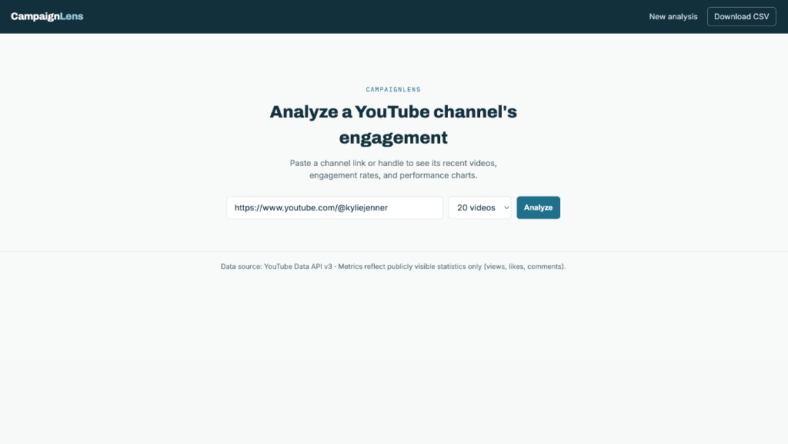
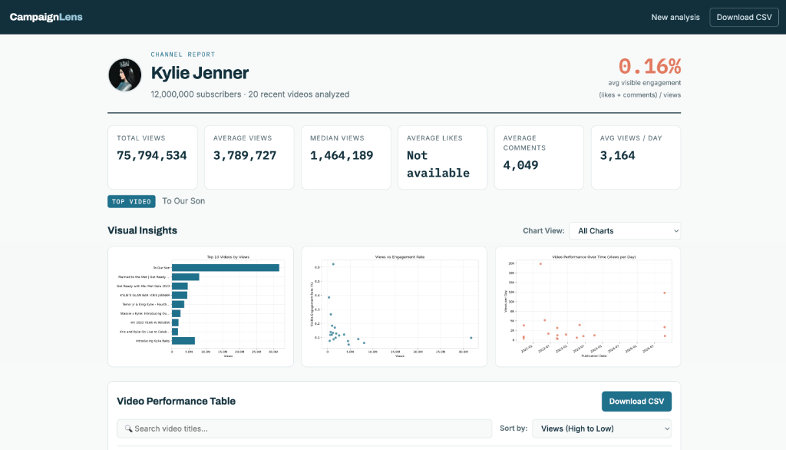
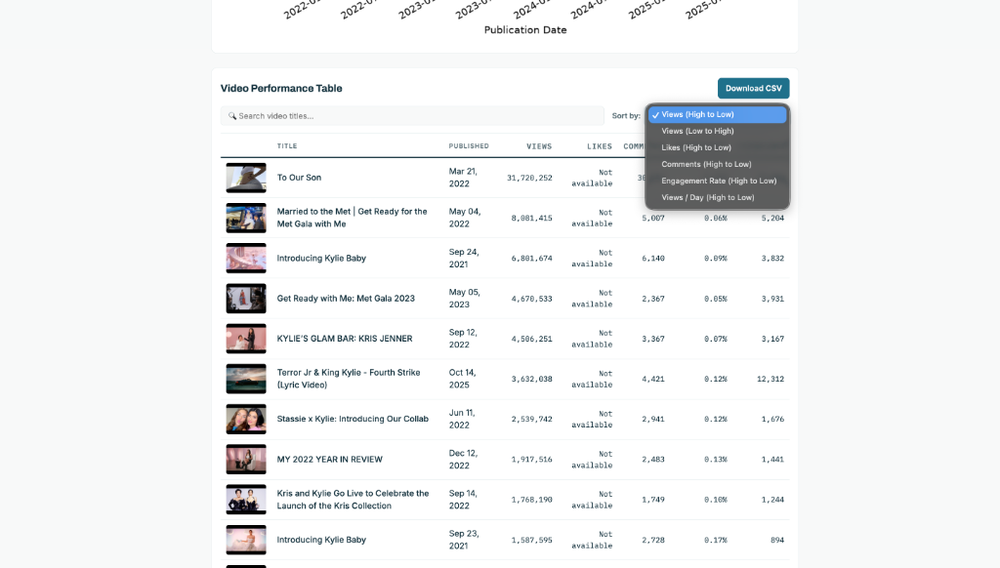
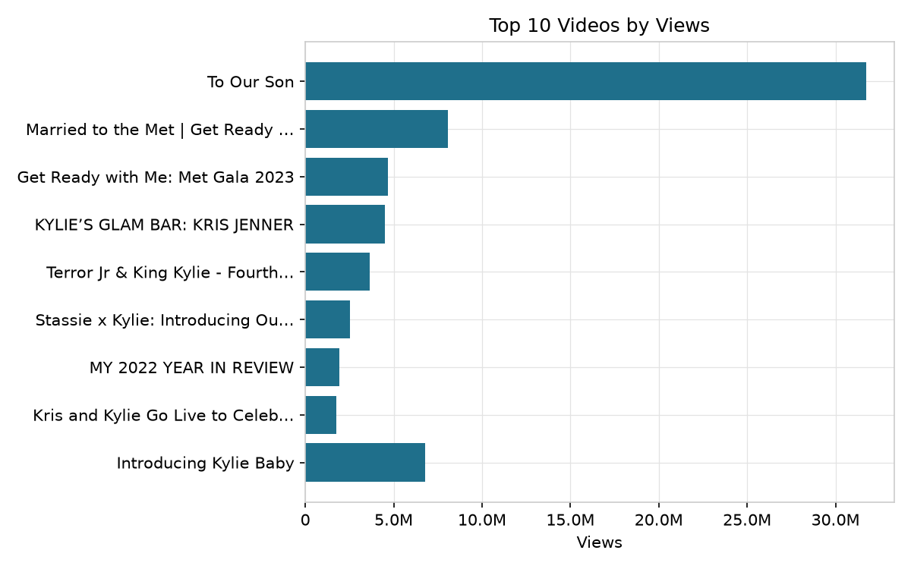
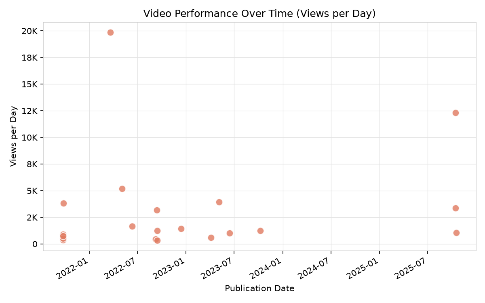
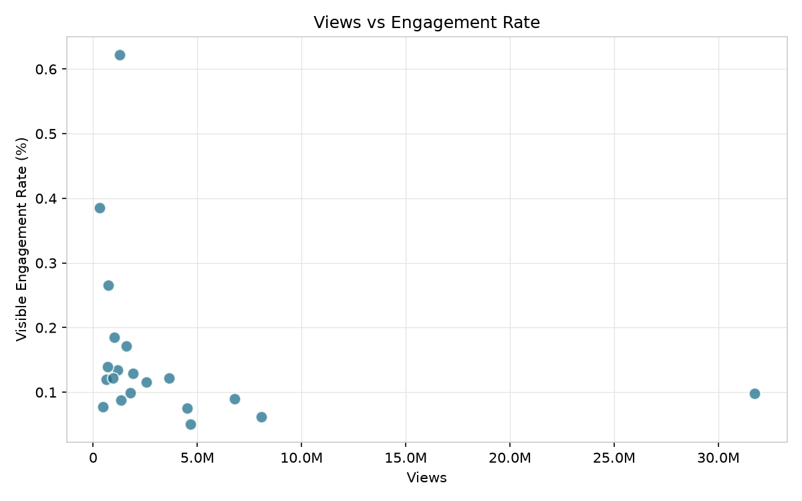

# CampaignLens

CampaignLens is a Python and Flask web application that analyzes the
performance of a YouTube channel's recent videos. The user enters a
public YouTube channel link, chooses how many recent videos to analyze,
and CampaignLens retrieves the channel's public video data through the
YouTube Data API v3, organizes it into a CSV, calculates performance
metrics, and displays the results on an interactive dashboard.

CampaignLens analyzes publicly visible YouTube performance only: views,
likes, comments, visible engagement rate, publication date, video
duration, and title characteristics. Shares, watch time, impressions,
and click-through rate are not exposed by the public YouTube Data API
and are not included.

## Features

- Analyze 10–50 recent public videos from any YouTube channel
- Accepts `@handle` links, channel-ID links, or a bare handle
- Summary statistics: average and median views, likes, comments
- Visible engagement rate, like rate, comment rate, and views per day
- Three Matplotlib visualizations, regenerated on every analysis
- Interactive dashboard: chart selector, table sorting, CSV download
- Graceful handling of missing data, hidden likes, and invalid input

## Interface & Screenshots

### 1. Search Page


*The home search interface allows users to enter a YouTube channel handle/link (e.g. `https://www.youtube.com/@kyliejenner`) and select the sample size of recent videos to analyze.*

### 2. Channel Dashboard Overview


*Comprehensive channel report header showing key performance metrics (total views, average views, median views, average comments, engagement rate) and high-level visual insight summaries.*

### 3. Video Performance Table


*Interactive video data table featuring real-time title filtering, multi-metric sorting (views, likes, comments, engagement rate, views/day), thumbnail previews, and instant CSV export.*

### 4. Performance Visualizations

#### Top 10 Videos by Views


*Horizontal bar chart showing the highest performing videos ordered by view count.*

#### Performance Over Time (Views per Day)


*Scatter plot illustrating publication date versus views generated per day.*

#### Views vs. Visible Engagement Rate


*Scatter plot illustrating the relationship between view counts and engagement rates across recent videos.*

## Technologies

- Python 3.11+
- Flask (web interface)
- Pandas / NumPy (data organization and analysis)
- Matplotlib (visualization)
- YouTube Data API v3 (data source)

## Project structure

```text
engagement-analyzer/
├── app.py                     # Flask application entry point (shared)
├── requirements.txt
├── routes/
│   ├── search_routes.py       # search page + /analyze (Abraham)
│   └── results_routes.py      # /results dashboard + /download (Khushi)
├── services/
│   ├── channel_parser.py      # channel URL/handle parsing (Abraham)
│   ├── youtube_api.py         # YouTube Data API client (Abraham)
│   └── data_storage.py        # CSV export (Abraham)
├── analysis/
│   ├── metrics.py             # loading, cleaning, metrics (Khushi)
│   └── charts.py              # Matplotlib chart generation (Khushi)
├── data/
│   └── videos.csv             # most recently collected dataset
├── screenshots/               # application UI screenshots
│   ├── search.png
│   ├── dashboard.png
│   ├── table.png
│   ├── chart-top-videos.png
│   ├── chart-performance-over-time.png
│   └── chart-views-vs-engagement.png
├── static/
│   ├── css/                   # stylesheets
│   └── charts/                # generated chart PNGs (not committed)
├── templates/                 # Jinja2 HTML templates
└── tests/
    ├── generate_mock_data.py  # sample dataset generator (Khushi)
    ├── test_analysis.py       # analysis tests (Khushi)
    └── test_channel_parser.py # channel parsing tests (Abraham)
```

## Installation

```bash
git clone https://github.com/kbhagra/engagement-analyzer.git
cd engagement-analyzer
python -m venv venv
source venv/bin/activate        # Windows: venv\Scripts\activate
pip install -r requirements.txt
```

## YouTube API setup

1. Open the [Google Cloud Console](https://console.cloud.google.com/)
   and create a project.
2. Enable the **YouTube Data API v3**.
3. Create an API key under Credentials.
4. Create a file named `.env` in the project root:

```
YOUTUBE_API_KEY=your_api_key_here
```

The `.env` file is listed in `.gitignore` and must never be committed.

## Running the application

```bash
python app.py
```

Open the address shown in the terminal (usually http://127.0.0.1:5000;
on macOS, if port 5000 is taken by AirPlay Receiver, run on another
port). Enter a channel link such as `https://www.youtube.com/@Nike`,
choose the number of videos, and click **Analyze Channel**. You are
redirected to the results dashboard.

To develop or demo the dashboard without an API key, generate sample
data first:

```bash
python tests/generate_mock_data.py
```

then open the `/results` page directly.

## Data collected

For each video: title, description, publication date, duration, view
count, like count, comment count, and thumbnail URL, together with the
channel name, ID, and subscriber count. Data is organized into a Pandas
DataFrame and stored locally as `data/videos.csv`.

## Calculations

All derived metrics are computed in `analysis/metrics.py`:

- **Visible engagement rate** = (likes + comments) / views × 100
- **Like rate** = likes / views × 100
- **Comment rate** = comments / views × 100
- **Views per day** = views / max(video age in days, 1)
- **Title length** = number of characters in the title

Design decisions:

- Missing likes or comments (hidden by the uploader or disabled) are
  kept as missing values, not converted to zero — a confirmed zero and
  "not available" mean different things. The dashboard displays these
  as "Not available" and excludes them from averages.
- Videos with zero views receive an undefined (missing) engagement
  rate rather than 0%, since a rate with no denominator is undefined.
- If likes are hidden but comments are visible, the engagement rate is
  computed from comments alone and represents a lower bound.
- The title-length vs engagement comparison uses Pearson correlation
  and is reported as correlation, not causation.

## Visualizations

Generated by `analysis/charts.py` and regenerated on every analysis:

1. **Top 10 videos by views** — horizontal bar chart
2. **Views vs visible engagement rate** — scatter plot
3. **Performance over time** — views per day by publication date,
   which compares videos more fairly than raw views because older
   videos have had more time to accumulate views

A chart selector on the dashboard switches between individual charts
or shows all three, and a sort control reorders the video table by
newest, most viewed, most liked, or most engaging.

## Error handling

- Invalid channel links, video links pasted by mistake, and legacy
  `/user/` URLs produce clear, user-facing error messages
- Unknown channels, API errors, and quota errors show an error page
- Missing or empty datasets show an error page instead of crashing
- Unknown sort/chart URL parameters fall back to defaults
- Missing statistics render as "Not available" throughout
- Charts skip cleanly when a metric has no usable data

## Team responsibilities

| Area | Owner |
|---|---|
| Search page, channel URL parsing, YouTube API client, CSV export | Abraham Alejandro Lopez Martin |
| Results dashboard, metrics, charts, video table, CSV download | Khushi Bakshi |
| Flask scaffolding, integration, testing, documentation | Shared |

## Ethical considerations

CampaignLens uses only publicly visible statistics from the official
YouTube Data API, respects API quotas, and stores data locally on the
user's machine. It does not collect private information, comment
content, or viewer data, and does not attempt to infer information
YouTube does not publish (such as shares or watch time).

Results should not be treated as proof that one video characteristic
causes better performance. Engagement is influenced by many factors,
including audience size, budget, brand popularity, and upload timing.

## Future improvements

- Comment sentiment analysis
- Multiple-channel comparison
- Legacy `/user/username` URL support
- Date-range filters and saved analysis history
- Interactive charts and online deployment

## Authors

- Khushi Bakshi — analysis, visualization, results dashboard
- Abraham Alejandro Lopez Martin — data collection, YouTube API, search page

## License

MIT License. This project was created for educational purposes as part
of the CS 122 final project at San José State University.
